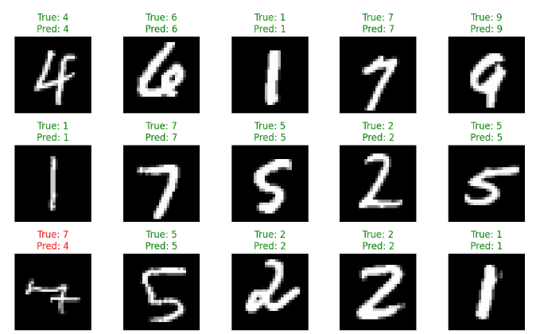

# IF3270_Tubes1_MachineLearning

> Tugas Besar 1 IF3270 Pembelajaran Mesin Feedforward Neural Network

<p align="justify"> 
Pada Tugas Besar 1 mata kuliah IF3270 Pembelajaran Mesin, kami akan mengimplementasikan Feed Forward Neural Network (FFNN) dalam bahasa pemrograman Python dari nol tanpa menggunakan pustaka pembelajaran mesin seperti Scikit-Learn, Tensorflow, atau PyTorch. Tugas ini bertujuan untuk memberikan pemahaman mendalam tentang cara kerja Artificial Neural Network, termasuk forward propagation, backward propagation, activation function, dan loss function.
</p>

<p align="center">
  
</p>

## Cara menjalankan program

1. Clone Repository

```bash
https://github.com/miannetopokki/IF3270_Tubes1_MachineLearning
```

2. Pindah ke directory IF3270_Tubes1_MachineLearning

```bash
cd IF3270_Tubes1_MachineLearning
```

3. Setup virtual environment Python

```bash
virtualenv venv
./venv/Scirpts/activate
```

3. Install dependency

```bash
pip install -r requirements.txt
```

4. Buka file src/numdiff/main.ipynb dan jalankan menggunakan kernel virtual env

## Pembagian Tugas

<table border="1">
    <tr>
        <th>No</th>
        <th>Nama</th>
        <th>NIM</th>
        <th>Pembagian Tugas</th>
    </tr>
    <tr>
        <td>1</td>
        <td>Hugo Sabam Augusto</td>
        <td>13522129</td>
        <td>Implementasi fungsi loss MSE, ReLU, tanh , linear, dan fitur tambahan seperti plotting dan graf.</td>
    </tr>
    <tr>
        <td>2</td>
        <td>Muhammad Zaki</td>
        <td>13522136</td>
        <td>Implementasi save and load, inisialisasi bobot, sigmoid menulis laporan.</td>
    </tr>
    <tr>
        <td>3</td>
        <td>Ahmad Rafi Maliki</td>
        <td>13522137</td>
        <td>Implementasi fungsi loss BCE dan CCE, menulis laporan.</td>
    </tr>
</table>
