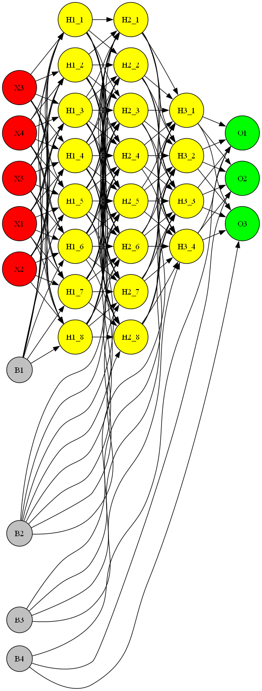

<h1 align="center">
IF3270_Tubes1_MachineLearning
</h1>

> Tugas Besar 1 IF3270 Pembelajaran Mesin Feedforward Neural Network

<p align="justify"> 
Pada Tugas Besar 1 mata kuliah IF3270 Pembelajaran Mesin, kami mengimplementasikan Feed Forward Neural Network (FFNN) dalam bahasa pemrograman Python dari nol tanpa menggunakan pustaka pembelajaran mesin seperti Scikit-Learn, Tensorflow, atau PyTorch. Tugas ini bertujuan untuk memberikan pemahaman mendalam tentang cara kerja Artificial Neural Network, termasuk forward propagation, backward propagation, activation function, dan loss function. Model ini dibangun untuk melakukan prediksi pada dataset 
<a href="https://www.openml.org/search?type=data&sort=runs&id=554" target="_blank">mnist_784</a>.
</p>

<p align="center">
  
  
</p>

## Implementasi
1. `src/numdiff` Implementasi MLP dengan perhitungan gradien menggunakan diferensiasi numerik (numerical differentiation). <br>
2. `src/autodiff` Implementasi MLP dengan perhitungan gradien menggunakan autodiff (gradien otomatis), hasil modifikasi dari pustaka [micrograd](https://github.com/karpathy/micrograd) (sangat lambat jika digunakan untuk dataset mnist_784).

## Keperluan
1. [Python v3.11+](https://www.python.org/downloads/release/python-3110/)

## Cara menjalankan program

1. Clone Repository

```bash
https://github.com/miannetopokki/IF3270_Tubes1_MachineLearning
```

2. Pindah ke directory IF3270_Tubes1_MachineLearning

```bash
cd IF3270_Tubes1_MachineLearning
```

3. Setup virtual environment Python

```bash
python -m venv venv
./venv/Scirpts/activate
```

3. Install dependency

```bash
pip install -r requirements.txt
```

4. Buka file src/numdiff/main.ipynb dan jalankan menggunakan kernel virtual env

## Pembagian Tugas

<table border="1">
    <tr>
        <th>No</th>
        <th>Nama</th>
        <th>NIM</th>
        <th>Pembagian Tugas</th>
    </tr>
    <tr>
        <td>1</td>
        <td>Hugo Sabam Augusto</td>
        <td>13522129</td>
        <td>Implementasi kelas MLP, Implementasi fungsi loss MSE, ReLU, tanh , linear, dan fitur tambahan seperti plotting dan graf, menulis laporan.</td>
    </tr>
    <tr>
        <td>2</td>
        <td>Muhammad Zaki</td>
        <td>13522136</td>
        <td>Debug MLP, Implementasi save and load, inisialisasi bobot, sigmoid, menulis laporan.</td>
    </tr>
    <tr>
        <td>3</td>
        <td>Ahmad Rafi Maliki</td>
        <td>13522137</td>
        <td>Debug MLP, Implementasi fungsi loss BCE dan CCE, kelas Activation, kelas Layer, menulis laporan.</td>
    </tr>
</table>
